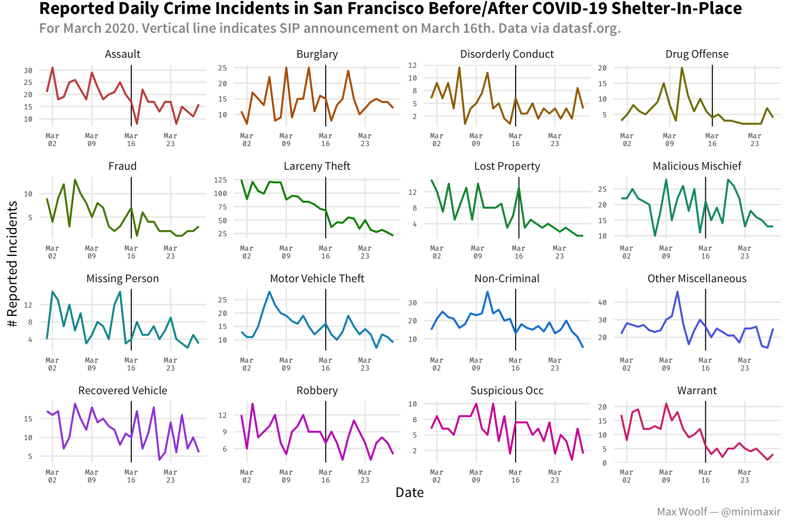

# sf-crimes-covid

Spot checking impact of SF shelter-in-places on crime reporting.

## Maintainer/Creator

Max Woolf ([@minimaxir](https://minimaxir.com))

*Max's open-source projects are supported by his [Patreon](https://www.patreon.com/minimaxir). If you found this project helpful, any monetary contributions to the Patreon are appreciated and will be put to good creative use.*

## License

MIT
